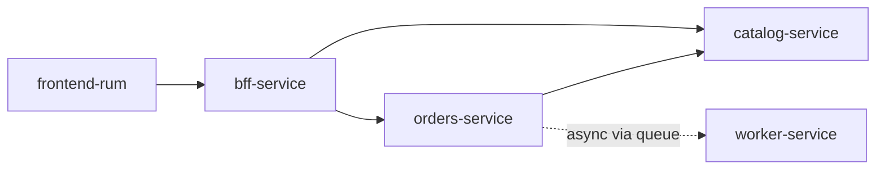

# Application workflow & service map

This document explains **how the lab fits together**: what each component does, how requests flow, and how that should appear in an observability **service map**.

For infrastructure and telemetry plumbing, see [architecture.md](./architecture.md) and [telemetry.md](./telemetry.md).

---

## What is the BFF?

**BFF = Backend For Frontend.**

It is a small API layer built **specifically for the browser app** (this lab’s React SPA). The frontend talks only to the BFF; the BFF talks to internal microservices on its behalf.

| Without BFF | With BFF (this lab) |
|-------------|---------------------|
| Browser must know URLs for orders, catalog, auth, flags, etc. | Browser calls one host: `http://localhost:3000` |
| CORS and credentials get harder with many backends | One origin for API calls |
| Session and feature-flag admin live in the UI or many services | BFF owns demo session + chaos gate writes |

In this repo the BFF (`bff-service`, Node/Express) is **not** heavy business logic. It:

1. **Proxies** catalog and orders HTTP APIs (`/api/products`, `/api/orders`, …)
2. **Owns demo session** endpoints (`/api/session/login`, logout)
3. **Administers chaos gates** (`GET/PUT /api/flags/chaos` → shared flag file for flagd)
4. **Applies BFF-layer chaos** (e.g. `chaos.bff_latency_ms` before create-order)
5. **Propagates trace context** (`traceparent`) to downstream services

The browser **never** calls `orders-service` or `catalog-service` directly.

---

## Services in this lab

### Application services (`service.name`)

These are **deployed processes** you run in Docker Compose. Each emits OTLP with its own `service.name`:

| `service.name` | Stack | Role |
|----------------|-------|------|
| `frontend-rum` | React + OTel JS | Browser UI, RUM traces, calls BFF only |
| `bff-service` | Node/Express | **Backend For Frontend** — gateway, session, flags |
| `orders-service` | Python/FastAPI | Checkout orchestration, DB, queue publish |
| `catalog-service` | Java/Spring | Product catalog API |
| `worker-service` | Go | Async consumer — finishes orders after checkout |

All share **`service.namespace=otel-demo`** (set in Compose). Use that attribute to **group** this application in your observability UI.

### Infrastructure (supporting, not “app logic”)

| Component | Used by | Notes |
|-----------|---------|--------|
| **Postgres** | catalog, orders, worker | Persistence; usually shown as DB dependency, not an app service |
| **RabbitMQ** | orders (publish), worker (consume) | Async handoff `orders.created` |
| **flagd** | BFF, orders, worker | OpenFeature chaos gates — control plane, not user data path |
| **otel-collector** | all apps + RUM | Telemetry pipeline only |

### External HTTP dependencies (not your services)

These are **third-party APIs** called over the internet. Spans tag them with `peer.service` and `dependency.type=third_party`:

| `peer.service` | Called from | Purpose |
|----------------|-------------|---------|
| `open-meteo` | orders-service | Weather enrichment at checkout |
| `stripe` | orders-service | Payment intent (optional; skipped if no API key) |
| `jsonplaceholder` | worker-service | Demo “fulfillment” HTTP call |

They are **dependencies**, not microservices you deploy. A service map should show them as **outbound HTTP edges**, not as peers equal to `orders-service`.

---

## End-to-end workflows

### 1. Browse catalog (synchronous)

```
frontend-rum  →  bff-service  →  catalog-service  →  postgres
```

1. User opens `/catalog` in the browser.
2. SPA calls `GET /api/products` on the BFF.
3. BFF proxies to `GET http://catalog:8082/products`.
4. Catalog reads products from Postgres and returns JSON.

**Worker and orders are not involved.**

### 2. Create order / checkout (synchronous + asynchronous)

**Synchronous part (HTTP, user waits for response):**

```
frontend-rum  →  bff-service  →  orders-service
                                    ├→ catalog-service  (product price)
                                    ├→ open-meteo       (weather)
                                    ├→ stripe           (optional payment)
                                    ├→ postgres         (INSERT status=pending)
                                    └→ rabbitmq         (publish orders.created)
```

1. User submits checkout → `POST /api/orders` on BFF.
2. BFF may apply `chaos.bff_latency_ms`, then forwards to orders.
3. **orders-service** orchestrates:
   - Resolve OpenFeature chaos flags
   - Fetch product from **catalog**
   - Call **Open-Meteo** and optionally **Stripe**
   - Insert order row (`status: pending`)
   - Publish message to **RabbitMQ** queue `orders.created`
4. HTTP response returns to the browser (often still `pending`).

**Asynchronous part (after HTTP returns):**

```
rabbitmq  →  worker-service  →  postgres (status → processing → processed/failed)
                             └→ jsonplaceholder (or local fallback)
```

5. **worker-service** consumes the message (trace context propagated in AMQP headers).
6. Marks order `processing`, calls JSONPlaceholder, updates Postgres to `processed` or `failed`.

**The BFF does not call the worker.** The handoff is **queue + DB status**, not a direct HTTP call.

### 3. Poll order status (synchronous)

```
frontend-rum  →  bff-service  →  orders-service  →  postgres
```

1. `/orders` page polls `GET /api/orders/:id`.
2. Orders reads current row from Postgres.
3. UI shows `pending` → `processing` → `processed` / `failed` when the worker has updated the row.

### 4. Chaos gates (control plane)

```
frontend-rum  →  bff-service  →  flags/chaos.flagd.json  →  flagd
                                      ↑
                    orders-service, worker-service (read via OpenFeature)
```

Toggling gates on `/gates` updates the shared flag file. **orders** and **worker** read flags at runtime (latency, fail Stripe, fail JSONPlaceholder, etc.). This path is for **fault injection**, not normal checkout data.

### 5. Load testing (Locust)

```
locust  →  bff-service  →  (same paths as above)
```

Locust simulates shoppers against the BFF only — same service map as the browser, without RUM.

---

## Service connection map (recommended view)

### Layer 1 — Application services (main map)

Show **only** deployable app processes as nodes:



Filter: `service.namespace = otel-demo` and `service.name` in the table above.

### Layer 2 — Infrastructure edges (optional)

- `catalog-service` → Postgres  
- `orders-service` → Postgres, RabbitMQ  
- `worker-service` → Postgres, RabbitMQ (consume)

### Layer 3 — External dependencies (separate styling)

- `orders-service` ──HTTP──► `open-meteo`, `stripe`  
- `worker-service` ──HTTP──► `jsonplaceholder`  

Use span attributes:

- `peer.service` — label on the edge (`stripe`, `open-meteo`, …)
- `dependency.type = third_party` — exclude from “my application” grouping

---

## OpenTelemetry concepts (for your observability tool)

| Concept | OTel field | Example |
|---------|------------|---------|
| **Who emitted the span** | `service.name` (resource) | `orders-service` |
| **What operation ran** | `span.name` | `orders.create_order`, `orders.call_open_meteo` |
| **Who was called** | `peer.service` (CLIENT span) | `stripe`, `open-meteo` |
| **Application group** | `service.namespace` | `otel-demo` |

**Common confusion:** OpenObserve (and some UIs) may draw **Stripe / Open-Meteo as “services”** because they use `peer.service` or URL host as map nodes. That is a **dependency view**. Your tool showing them as **HTTP calls** is also correct — and often better for an application service map.

**Rule of thumb:**

- **Nodes** = `service.name` of processes you deploy  
- **Edges to externals** = CLIENT spans with `dependency.type=third_party`  
- **Do not** treat `span.name` (e.g. `orders.call_stripe_payment_intent`) as a separate service

Trace propagation:

- **HTTP:** BFF injects `traceparent` when calling orders/catalog  
- **Messaging:** orders injects context into RabbitMQ headers; worker extracts it — one trace can span checkout → worker

---

## Grouping multiple applications

When you add more apps to the same observability backend, use **resource attributes**, not span names:

| Attribute | This lab | Multi-app use |
|-----------|----------|----------------|
| `service.name` | `bff-service`, … | Unique per microservice |
| `service.namespace` | `otel-demo` | **Primary group** — e.g. `shop`, `billing` |
| `deployment.environment` | `demo` (via collector) | `staging`, `prod` |
| `lab.stack` | `otel-microservices` | Optional product/stack id |

Example for a new app:

```bash
OTEL_RESOURCE_ATTRIBUTES=service.namespace=my-shop,deployment.environment=prod
```

In your service map UI:

1. **Group by** `service.namespace`  
2. **Hide or collapse** spans where `dependency.type = third_party`  
3. **Keep** async edges: orders → RabbitMQ → worker (not BFF → worker)

---

## Quick reference — who calls whom

| From | To | When |
|------|-----|------|
| Browser | BFF | All UI API calls |
| BFF | catalog-service | Browse products |
| BFF | orders-service | Create/list/get orders |
| orders-service | catalog-service | Product lookup at checkout |
| orders-service | open-meteo, stripe | Checkout enrichment |
| orders-service | RabbitMQ | After order saved |
| worker-service | RabbitMQ | Process `orders.created` |
| worker-service | jsonplaceholder | Fulfillment demo call |
| orders, worker, BFF | flagd | Chaos flag evaluation (OpenFeature) |
| All app services | otel-collector | OTLP traces/metrics/logs |

---

## Related docs

- [BFF service detail](./services/bff.md) — endpoints and files  
- [Orders service](./services/orders.md) — checkout steps  
- [Worker service](./services/worker.md) — async processing  
- [Architecture](./architecture.md) — stack diagram and telemetry rules  
- [Telemetry wiring](./telemetry.md) — collector and backends  
- [Chaos / feature flags](./chaos-and-feature-flags.md) — gate reference
